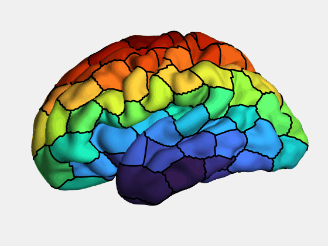
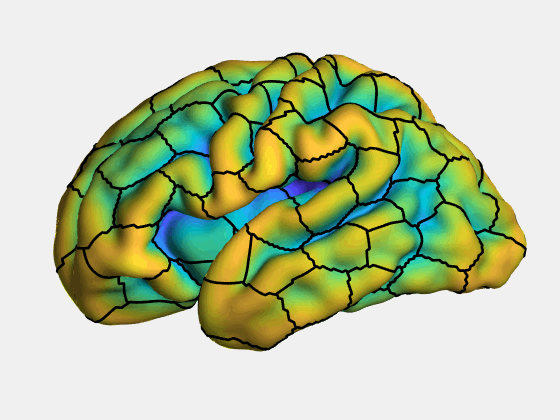

# BrainSurfaceAnimation

After years of the number one question being asked at any of my talks being "hoW dO yoU dO tHOsE anIMAtiOns?!??", this is how, this is the answer. My secrets are now yours, so you have no more excuses for boring static PowerPoints :)

This will show how to make an animation of a brain surface mesh morphing in MATLAB. You can morph the vertex positions, the values of each vertex, and/or the colormap being used.

See the header of SurfMorphAnimation.m for full details of all the functionality, and Example.m for examples of how to use it.

The script makes use of plotSurfaceROIBoundary, another toolbox I wrote. I have included it in here for ease of use. I also use the 'gif' function (https://au.mathworks.com/matlabcentral/fileexchange/63239-gif) , and 'export_fig' toolbox (https://github.com/altmany/export_fig).

The example data was obtained from https://gin.g-node.org/kcl_cdb/dhcp_fetal_brain_surface_atlas

## What you need for this code to work

In the simplist case, you just need closed surfaces with vertex correspondance (like say, a mesh of the brains cortex you get from freesurfer ie., white, pial, inflated, sphere; or surfaces of different brains where have been aligned using something like [MSM](https://fsl.fmrib.ox.ac.uk/fsl/fslwiki/MSM]). If you have a vector of the ROI ID for each vertex and/or data for each ROI/vertex, further functionality/fun is capable of being done.

## Things this code can do

So many pointless things!

To start with we can just animate the brain growing from 21 weeks gestational age to 36 weeks

We can also plot the borders of a parcellaiton on this growing brain!

We can *colour* the growing brain!

We can colour without the borders!

We can also plot some other feature, like sulcal depth on the surface, showing "absolute" changes in this property...

Showing relative changes in this property 

Or we can just plot the sulcal depth at 36 weeks on to all timepoints and watch them gyri form!

We can also morph between a brain surface and its spherical projection

For more fun, we can show the surface inflation to a sphere and back again, while morphing from sulcal depth to parcel ID AND changing the colormap at the the same type 

Finally, we can have a rave on the brain

## To gif or not to gif, that is the question

To save the output, the code gives two options: directly save to a .gif file and/or save each frame as a .png. Why these two options? The .gif option is easier and will give you an animation you can use right out of the box. However, I have personally found that the way MATLAB makes gifs is less than ideal and can result in poor quality. I found external gif making tools (like Photoscape X or https://ezgif.com/maker) could give better results, and can give you a lot more control (for example, you can vary the timing of individual frames which can be very useful). To use these external tools, you need to provide the frames to use (i.e., the .png files, also not you can import a .gif made from MATLAB into the to fiddle with setting but you run the risk of further compression artefacts occuring then). The other benefit of .png files is you can import them into your video maker of choice (e.g., Windows video Editor, Hitfilm Express) and make a video out of them. This will preserve the quality of each frame a lot better than simply making a gif. 

The choice is yours.

## This this cannot do

The main one is it cannot morph between the boundaries of parcellations (it can do it if you only want to use the colours, if you are ok with it looking a little strange). It is conceptually the same as morphing the vertices/vertex data/colormap, I just didn't get around to doing it because it is a very niche thing to try to do (and making the morphing animations is *already* a very niche thing to do). Perhaps one day...

## Contact

If you have issues/problem/just want to ask why the hell I made this, email me at stuart.oldham@mcri.edu.au

## Licensing

This code uses some packages others have kindly written.

'gif.m'

Copyright (c) 2017, Chad Greene
All rights reserved.

Redistribution and use in source and binary forms, with or without
modification, are permitted provided that the following conditions are met:

* Redistributions of source code must retain the above copyright notice, this
  list of conditions and the following disclaimer.

* Redistributions in binary form must reproduce the above copyright notice,
  this list of conditions and the following disclaimer in the documentation
  and/or other materials provided with the distribution

* Neither the name of NASA Jet Propulsion Laboratory nor the names of its
  contributors may be used to endorse or promote products derived from this
  software without specific prior written permission.

THIS SOFTWARE IS PROVIDED BY THE COPYRIGHT HOLDERS AND CONTRIBUTORS "AS IS"
AND ANY EXPRESS OR IMPLIED WARRANTIES, INCLUDING, BUT NOT LIMITED TO, THE
IMPLIED WARRANTIES OF MERCHANTABILITY AND FITNESS FOR A PARTICULAR PURPOSE ARE
DISCLAIMED. IN NO EVENT SHALL THE COPYRIGHT OWNER OR CONTRIBUTORS BE LIABLE
FOR ANY DIRECT, INDIRECT, INCIDENTAL, SPECIAL, EXEMPLARY, OR CONSEQUENTIAL
DAMAGES (INCLUDING, BUT NOT LIMITED TO, PROCUREMENT OF SUBSTITUTE GOODS OR
SERVICES; LOSS OF USE, DATA, OR PROFITS; OR BUSINESS INTERRUPTION) HOWEVER
CAUSED AND ON ANY THEORY OF LIABILITY, WHETHER IN CONTRACT, STRICT LIABILITY,
OR TORT (INCLUDING NEGLIGENCE OR OTHERWISE) ARISING IN ANY WAY OUT OF THE USE
OF THIS SOFTWARE, EVEN IF ADVISED OF THE POSSIBILITY OF SUCH DAMAGE.
